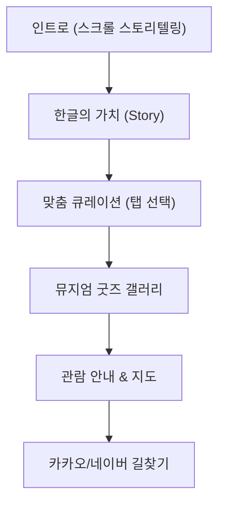

# 🏛️ 국립한글박물관 — 웹사이트 리뉴얼

> 한글의 전통적 가치와 현대적인 디지털 경험을 결합한 공공기관 웹사이트 리뉴얼 프로젝트

<p>
  
  
  
  
  
  
  
</p>

## 🖼️ 데모
| 인트로 스크롤 스토리텔링 | 맞춤 큐레이션 탭 | 관람 안내 & 지도 |
|---|---|---|
| | | |

배포 링크: https://tmdnd0568.github.io/korea/

## ✨ 주요 기능 & 인터랙션

### 1. 인터랙티브 한글 역사 스토리텔링 (Scroll-scrub Intro)
인트로 섹션은 이미지 시퀀스를 스크롤에 맞춰 재생하는 스크롤 스크럽 방식으로, 스크롤 진행 구간에 따라 **한글 창제(1443.12) → 훈민정음 반포(1443.09) → 한글날 확정(10월 9일)**의 역사 정보 카드가 순차적으로 나타납니다. 배경에는 Three.js 기반 3D WebGL 캔버스와 GSAP 애니메이션으로 몰입감 있는 연출을 더했습니다.

### 2. 방문 목적별 맞춤 큐레이션
관람객 유형(가족 동반 / 학생 / 외국인 관광객)에 따라 탭으로 전환되는 추천 동선을 제공합니다.
| 탭 | 대상 | 특징 |
|---|---|---|
| 자녀동반 코스 | 30대 부모 | 한글놀이터, 어린이 기획 전시실, 야외 정원 (약 90분) |
| 학생 탐구 코스 | 초중고·대학생 | 훈민정음실 원본 분석, 한글도서관, 정보화 전시존 (약 60분) |
| 외국인 추천 코스 | 외국인 관광객 | 다국어 오디오 가이드, 미디어 아트, 뮤지엄 카페 (영/중/일 지원) |

### 3. 한글 타이포그래피 굿즈 갤러리
국립한글박물관의 아이덴티티를 담은 시그니처 굿즈(무드등, 키링, 텀블러, 포스터 등)를 카드형 그리드로 소개합니다.

### 4. 관람 안내 & 다크 테마 지도
Leaflet 기반 다크 테마 지도에 위치 오버레이 카드를 결합해 관람시간·요금·주소·대중교통 정보를 안내하고, 카카오맵·네이버지도 길찾기 연동 버튼을 제공합니다.

### 5. 다국어 지원 (KO/EN)
`lang.js`를 통해 헤더 내비게이션부터 큐레이션, 굿즈 설명까지 전 영역에 `data-translate` 속성 기반 한/영 전환 기능을 구현했습니다.

## 🧭 사용자 플로우


## 🗂️ 폴더 구조
```
korea/
├── img/                 # 인트로 스크럽 시퀀스, 건축 이미지 등
├── index.html            # 메인 페이지
├── style.css              # 스타일시트
├── lang.js                 # 한/영 다국어 전환 스크립트
├── brt.js / brt_v6.js      # 스크롤 인터랙션 · 3D 배경 · 큐레이션 탭 스크립트
├── logo.png
└── real_002.mp4, real_01.mp4, scoll_001.mp4, sjdw_002.mp4  # 배경·인트로 영상 소스
```

## 🤖 AI 활용 프로세스
이 프로젝트는 기획 초안부터 카피라이팅까지 각 단계에서 AI를 1차 초안 생성 도구로 활용하고, 그 결과를 검증·수정하는 방식으로 진행했습니다.

**① 기획 단계 —**
> (유저들이 이 홈페이지에 들어오면 재미를 줄수 있는 경험 할수 있는 사이트를 제작할거야 
일단 매인화면은 3D동영상을 무한루푸로 제생할수 있게 제작하고 
그후 정보 탭에서는 스크롤 스크럽 기능을 통한 세종대왕의 업적을 
표현 하고 싶어 
그후 이페이지는 한글 박물관 을 알리기위한 사이트 이기떄문에 
한글,영어 전환 을 할수 있게 제작할거야.))

**② 디자인 단계 —**
> (한글의 조형미를 살리기 위해 로고를 제작할떄 세련되고 트렌디 한 로고를 제작할거야 
로고에는 이페이지 국립한글박물관 인것을 바로 알수 있고 한글의 트렌디함을 한번에 잡을수 있는 로고를 제작해줘.  )

**③ 카피라이팅 단계 —**
> (세종대왕님의 한글제작부터 백성들의 실생활에 사용하는 거 까지 한눈에 알아볼수 있게 제작할거야 어떤 내용들을 넣으면 좋을까 ?

2. 너는 한글을 배우고 있는 20대 미국 유학생이야 아래 내용들을 보고 실제로 구매 할수 있을거 같은지 확인해줘. 
한글국립박물관 에는 실제 판매하고 있는 한글 굿즈들이 있어 그중에 
제일 괜찮았던거는 아크릴, 키링 텀블러야 위 이미지의 내용들을 
실제로 넣을건데 괜찮은지 확인해줘 )

## 🩹 트러블슈팅
| 이슈 | 원인 | 해결 |
|-화질이 너무 꺠짐 --|-동영상 해상도--| ---|
|-화질이 너무 꺠짐 --|-동영상 해상도--| 동양상 크기를 키워 프레임단위로 다시 쪼겠습니다.|
| (이슈 내용) | (원인) | (해결 방법) |

## 📄 링크

- 배포주소:https://tmdnd0568.github.io/korea/
- 피그마:https://www.figma.com/design/EUConokGNz4XV0xLDVhFXA/%EB%A6%AC%EB%89%B4%EC%96%BC-%ED%8E%98%EC%9D%B4%EC%A7%80?node-id=112-451&t=H39TUCHHl6cZ6LEe-1
- 노션:https://app.notion.com/p/ee41a4be835a82d6b08781a6a826c3bd?source=copy_link
